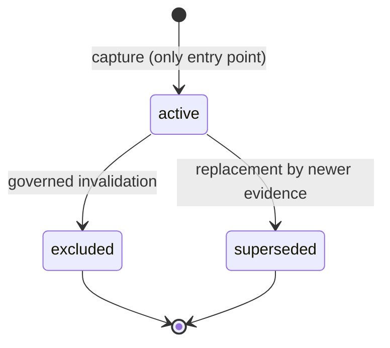

# Phase 1 Slice 6 — Technical Design

**Status:** Draft — pending approval
**Phase:** 1
**Slice:** 6
**Depends on:** `PHASE_1_SLICE_6_PLAN.md` (accepted)
**Artifact type:** Technical Design (precedes Migration Plan / SQL Draft)

---

## 1. Purpose

This document translates the accepted Phase 1 Slice 6 plan into a technical design for evidence lifecycle governance. It specifies the canonical lifecycle model, the supersession and invalidation designs, the uniform application of the vocabulary across all evidence stores, and the foreign-key governance problem that the subsequent Migration Plan must resolve.

This is an architecture artifact. It contains no SQL, no application code, and no migration steps. Its output is a set of design decisions and invariants precise enough that the Migration Plan can be drafted mechanically from it, and constrained enough that no decision of consequence is deferred to implementation.

The scope boundaries established in the plan remain binding: no deletion workflow, no correction event store, no UI change, no API contract change, no AI behavior change, and no read-path cutover are designed here.

## 2. Design Goals

The design is governed by five goals, in priority order:

1. **Standardized lifecycle governance.** All evidence tables adopt a single canonical lifecycle vocabulary with identical semantics. Lifecycle state is the sole authority for reasoning eligibility; no consumer may infer eligibility from timestamps, row ordering, or table-specific conventions. Governance actions that change lifecycle state are explicit, auditable, and uniform across evidence types.

2. **Backward compatibility.** Every row written by Slices 1–5 remains valid under the new design without data migration of content. Every existing insert path in the scan write route continues to function unmodified. The design widens what is permitted; it never narrows what already exists.

3. **Additive-first evolution.** Schema evolution proceeds by constraint widening and metadata addition, never by destructive change. Existing columns are not renamed, retyped, or dropped. Existing values are not rewritten. Where the design identifies future metadata needs (transition reason, transition timestamp), it specifies them as additive columns whose absence today is legal.

4. **Service-role-only lifecycle transitions.** No client-facing write path may change a lifecycle state. Evidence rows are inserted by the existing service-role write path and transition only through future service-role governance actions. No new RLS policies granting client mutation are introduced, and the design explicitly forbids them.

5. **Compatibility with existing dual-write.** The `POST /api/scan` write order — `scan_records`, `consent_snapshots`, the evidence tables, and the legacy `analyses` compatibility insert — is preserved byte-for-byte in behavior. The design imposes no new write-time obligations on the scan path: all rows continue to be captured as `active`, and no transition logic executes at capture time.

## 3. Lifecycle Model

The canonical lifecycle vocabulary consists of three states, applied uniformly to all evidence records:

- **`active`** — the evidence is valid and eligible for reasoning. It is the default and only state assigned at capture. Current-state queries resolve exclusively against `active` rows.

- **`excluded`** — the evidence has been removed from active reasoning by a governed action: invalidation, deletion governance, or consent withdrawal. The row and its structure are retained. For reasoning eligibility, the state is terminal: excluded evidence never re-enters reasoning.

- **`superseded`** — the evidence has been replaced by a newer evidence record of the same type. It is retained for traceability and audit but is ineligible for current-state reasoning.

### Allowed transitions

The transition graph is deliberately small:

- `active → excluded` is the invalidation transition (Section 5).
- `active → superseded` is the supersession transition (Section 4).
- No other transitions exist. In particular: no state transitions back to `active`; `excluded` and `superseded` do not transition to each other; and no row is ever created in a non-`active` state. Reinstatement of evidence, if ever required, is modeled as capture of a new `active` row, not as a reverse transition — this preserves the append-only philosophy and keeps the audit trail linear.

### Session-level distinction

`scan_records.status` remains a session-level eligibility state with the two-value vocabulary `('active','excluded')`. It intentionally does not adopt `superseded`: a scan session is never replaced — a re-scan produces a new session. The design treats the session state and the per-evidence lifecycle state as distinct dimensions that happen to share two value names. No rename or restructuring of `scan_records.status` is part of this design.

## 4. Supersession Design

**Replacement model.** Supersession models exactly one situation: a newer evidence record of the same type exists and replaces an older one for reasoning purposes. It is never used for invalidation, quality downgrades, or deletion — those concerns map to `excluded` or to future slices. A record without a replacement cannot be `superseded`.

**Traceability.** Every superseding record must reference the record it replaces. The existing `supersedes_evidence_id` self-reference on `ai_analysis_evidence` is the template: a nullable self-referencing key on the newer row pointing at the older row. The Technical Design adopts this pattern as the standard for all evidence tables that can be superseded; the Migration Plan determines when each table physically receives the column (it is required before any supersession workflow exists for that table, not necessarily in Slice 6's migration). Traceability is directional and single-hop per record; chains of supersession are traversable by following the reference.

**Immutable evidence.** The superseded row's captured content is never mutated. Supersession changes lifecycle state and nothing else on the prior row. This preserves the append-only evidence philosophy: history is added to, never rewritten.

**Derived current state.** The authoritative current evidence for a scan is derived by selecting `active` rows — never by `created_at` ordering, insertion order, or maximum identifiers. The design invariant is: **at most one `active` evidence record per single-valued evidence type per scan record** (user description, image, AI analysis). `product_mention_evidence` is multi-valued per scan and is exempt from the at-most-one constraint, but individual mention rows follow the same state semantics. Whether this invariant is enforced declaratively (partial unique constraint) or procedurally (transition-time check) is a Migration Plan decision; the invariant itself is not negotiable.

**No silent overwrite.** No write path may update an existing evidence row's content in place, and no capture path may implicitly supersede prior evidence. Supersession is always an explicit, governed, two-part action: insert the new `active` row with its `supersedes_evidence_id` reference, then transition the prior row to `superseded`. No code path performing this action ships in Slice 6; the design makes the state reachable and well-defined so that a future workflow can implement it without semantic debate.

## 5. Invalidation Design

**Invalidation is the `excluded` transition.** There is no separate `invalidated` state. Any governed action that removes evidence from reasoning — data-quality invalidation, deletion governance, consent withdrawal — resolves to the single transition `active → excluded`. Collapsing these into one state keeps the eligibility model binary at query time (`active` vs. everything else) while the *reason* for exclusion is carried in metadata rather than in the state vocabulary.

**Reason metadata.** Every future transition to `excluded` must record, at minimum: a machine-readable reason and a transition timestamp. The design specifies these as additive, nullable columns (or an equivalent additive structure) so that all existing rows — which have never transitioned — remain valid with the metadata absent. The physical form (column names, enumeration of reason values, whether metadata lives on the evidence row or in a companion transition log) is delegated to the Migration Plan, with the constraint that whatever form is chosen must be uniform across all evidence tables.

**Future auditability.** The metadata design anticipates the audit question "why is this evidence excluded, and since when?" being answerable from the schema alone, without application logs. When the Correction Event store (out of scope here) arrives, exclusion reasons must be able to reference correction events; the reason structure should therefore not preclude a foreign reference, though none is added now.

**Not deletion.** Exclusion retains the row in full. It is the tombstone-compatible state: the record exists, is structurally intact, and is auditable, but contributes nothing to reasoning. Physical deletion is a separate, future concern with its own governance.

**Not editing evidence.** Exclusion never modifies captured content. Content redaction — clearing sensitive payloads, removing storage binaries — is a distinct governed operation that a future deletion slice layers *on top of* exclusion. The lifecycle transition and the content operation are architecturally separate so that each can be audited, authorized, and sequenced independently.

## 6. Evidence Compatibility

The design applies to the five stores as follows:

- **Scan Record (`scan_records`).** Participates as the session anchor, not as evidence. Its `status` keeps the two-value session vocabulary `('active','excluded')` and does not gain `superseded` (Section 3). No structural change is designed for this table.

- **User Description Evidence (`user_description_evidence`).** Currently permits `('active','excluded')`. The design widens the permitted vocabulary to the full canonical set, adding `superseded` as a legal value. Single-valued per scan: subject to the at-most-one-`active` invariant. No existing row changes value.

- **Image Evidence (`image_evidence`).** Same treatment as user description evidence: vocabulary widened to the canonical set, at-most-one-`active` invariant applies. Storage binary lifecycle (the underlying object) is explicitly out of scope; only the evidence row's lifecycle state is governed here.

- **Product Mention Evidence (`product_mention_evidence`).** Vocabulary widened to the canonical set. Multi-valued per scan: multiple `active` mention rows are legal simultaneously, so the at-most-one invariant does not apply at the scan level. Each row individually follows the transition graph.

- **AI Analysis Evidence (`ai_analysis_evidence`).** Already conforms to the canonical vocabulary and already carries `supersedes_evidence_id`. It is the reference implementation for the other tables. No vocabulary change is required; the design change for this table is confined to foreign-key posture (Section 7).

In all cases the capture path is untouched: every insert continues to write `evidence_status = 'active'`, and no table gains a new required column that the existing write path would have to populate.

## 7. Foreign-Key Governance

This section defines the design problem. It deliberately does not prescribe the implementation.

**The problem.** The deletion posture of foreign keys referencing `scan_records` is inconsistent across the Evidence Layer:

- `consent_snapshots` and `ai_analysis_evidence` cascade on parent delete;
- `user_description_evidence`, `image_evidence`, and `product_mention_evidence` restrict;
- legacy `analyses.scan_record_id` sets null.

Under the tombstone-first posture established in `PHASE_1_DELETION_RETENTION_BEHAVIOR_V1.md`, a physical delete of a scan record must not silently destroy evidence or consent history. The cascading paths contradict this: today, a single parent delete would silently remove consent snapshots — the exact failure mode flagged as finding P1-1 in the Slice 1 dual-write design — and AI analysis evidence with them, while the restricting tables would block the same delete. The layer therefore has three different answers to the question "what happens when a scan record is deleted?", which makes any future deletion workflow unimplementable without first resolving the inconsistency.

**The design position.** The plan's accepted direction is reconciliation toward the restrictive posture, so that physical deletion becomes an explicit, governed operation rather than a referential side effect. This Technical Design records that direction as the target end-state and records the constraint that the reconciliation is a delete-semantics change requiring explicit approval (Acceptance Criterion 4 of the plan).

**What is deferred.** The concrete reconciliation — which constraints change, in what order, how existing referential behavior is verified before and after, and how the legacy `analyses` set-null posture is handled — is the Migration Plan's responsibility. Deletion semantics will be reconciled during migration planning, where each constraint change can be evaluated with its blast radius, rollback story, and verification steps attached. This document intentionally stops at the problem statement and the target posture.

## 8. Compatibility

**API unchanged.** `POST /api/scan` continues to accept the same request shape, execute the same insert sequence, and return the same success and error contracts. The design adds no write-time transition logic and no new required fields, so the route has nothing to change. Vocabulary widening is invisible to a writer that only ever writes `active`.

**UI unchanged.** No component, page, or client behavior depends on lifecycle states beyond what already exists, and this slice introduces no state that any current read path returns. There is no client-visible surface to update.

**`analyses` unchanged.** The legacy table remains the exclusive read source for history and dashboard, and it has no lifecycle column. The design documents this gap and deliberately defers it: adding lifecycle state to `analyses` would put the established read contract at risk for no benefit to this foundation slice. The compatibility insert into `analyses` continues unmodified.

**Dual-write unchanged.** The scan write path's ordering, transactional behavior, and failure semantics are preserved. All designed changes are constraint-widening or FK-posture changes that do not alter what the write path inserts or how it handles errors. Backward compatibility of the dual-write is a hard acceptance condition, not a best effort.

## 9. Risks

Technical risks only; product and process risks are tracked in the plan.

1. **FK posture change alters delete behavior.** Moving cascading constraints to a restrictive posture converts silent cascade deletes into hard errors. Any existing operational script or manual procedure that relies on cascade behavior would begin failing. Mitigation: the Migration Plan must inventory delete callers (expected: none in application code) before the change ships, and the change requires explicit approval as a delete-semantics change.

2. **Constraint widening masks writer bugs.** Once `superseded` is a legal value on all tables, a defective writer could insert it directly at capture, violating the "rows are born `active`" invariant with no constraint to stop it. Mitigation: the invariant is procedural until a transition workflow exists; the Migration Plan should consider whether capture-time defaults and service-role discipline are sufficient or whether a declarative guard is warranted.

3. **At-most-one-`active` invariant is not yet enforceable declaratively without care.** A partial unique constraint on `(scan_record_id)` where status is `active` is the natural enforcement, but adding it retroactively fails if historical data already violates the invariant. Mitigation: the Migration Plan must verify current data satisfies the invariant before choosing declarative enforcement.

4. **Metadata design lock-in.** If the exclusion-reason structure chosen later is too narrow (e.g. free text only), future correction-event integration will require rework. Mitigation: this design constrains the metadata to be machine-readable and reference-capable; the Migration Plan inherits that constraint.

5. **Divergence between `ai_analysis_evidence` and the other tables during rollout.** Until all tables carry the widened vocabulary, queries written against the canonical model would behave differently per table. Mitigation: the vocabulary widening for the three non-AI tables must ship as one migration unit, not incrementally.

## 10. Exit Criteria

The Migration Plan (`PHASE_1_SLICE_6_MIGRATION_PLAN.md`) may begin only when all of the following are true:

1. The lifecycle model in Section 3 — three states, the transition graph, and the "born `active`" rule — is reviewed and accepted without open questions.
2. The supersession invariants in Section 4 are accepted, including the at-most-one-`active` invariant and the `supersedes_evidence_id` traceability pattern as the cross-table standard.
3. The invalidation design in Section 5 is accepted, including the decision that exclusion reasons are metadata rather than additional states, and that content redaction is architecturally separate from the lifecycle transition.
4. The per-table treatment in Section 6 is confirmed, including the exemption of `product_mention_evidence` from the at-most-one invariant and the exclusion of `scan_records.status` from the `superseded` value.
5. The foreign-key reconciliation direction in Section 7 (restrictive posture as target end-state) is explicitly acknowledged as a delete-semantics change whose concrete resolution belongs to the Migration Plan.
6. The compatibility guarantees in Section 8 are accepted as hard constraints on the Migration Plan: no API, UI, `analyses`, or dual-write change may be introduced by the migration.
7. The risks in Section 9 are acknowledged, and risk items 1 and 3 are carried into the Migration Plan as mandatory pre-migration verification steps.
8. No SQL is drafted and no code is written until this design is approved.

---

*End of Phase 1 Slice 6 Technical Design.*
