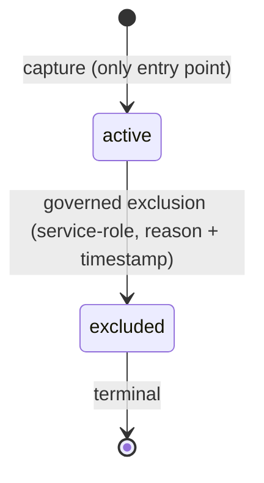
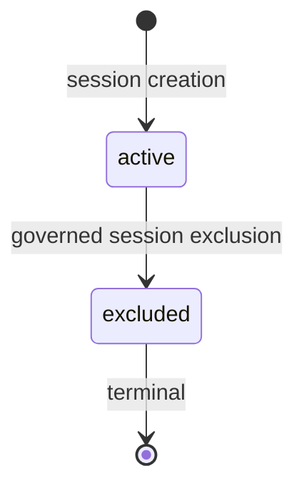

# Phase 1 Slice 7 — Technical Design

This document follows the approved Slice 7 Plan (`docs/PHASE_1_SLICE_7_PLAN.md`).

This is a design artifact only. It contains no implementation, no SQL, no API endpoint definitions, and no UI behavior. It modifies no existing architecture.

---

## 1. Status

**Status:** Draft — pending approval
**Phase:** 1
**Slice:** 7
**Depends on:** `PHASE_1_SLICE_7_PLAN.md` (approved), Slice 6 closure (canonical vocabulary, transition metadata, reconciled FK posture)
**Artifact type:** Technical Design (precedes Migration Plan and any implementation authorization)

---

## 2. Design Goals

1. Make the `active` → `excluded` lifecycle transition operational as a governed, internal, service-role-only capability.
2. Preserve every architectural invariant established in Slices 1–6: append-only evidence, immutable payloads, immutable consent snapshots, Evidence Layer authority, `analyses` as compatibility surface only.
3. Define transition behavior precisely enough that the subsequent Migration Plan and implementation can proceed without semantic decisions being made at coding time.
4. Introduce the minimum surface required: no new stores, no new markers, no new read or write contracts beyond the transition itself.

---

## 3. Architectural Position

- **Evidence Layer remains the source of truth.** All lifecycle state lives in the evidence tables introduced by Slices 1–5 and governed by the Slice 6 vocabulary. No other surface holds authoritative lifecycle information.
- **`analyses` remains a compatibility surface only.** It carries no lifecycle state, receives no markers, and is not consulted or updated by any transition. Its divergence from excluded evidence is a documented residual of this slice, resolved by future read-surface work — not by extending `analyses`.
- **The transition capability is a post-capture governance path.** It is architecturally orthogonal to the `POST /api/scan` capture flow. The capture dual-write (evidence-first, `analyses` compatibility insert last) is not modified, invoked, or bypassed by transitions.
- **No new evidence objects are introduced.** The capability operates exclusively on existing rows in existing tables. The deferred Phase 1 objects (Correction Event, Evidence Confidence Posture, governance event stores) remain deferred.

---

## 4. Transition Authority

- **Service-role only.** Lifecycle transitions may be initiated exclusively through the established service-role posture used by the Slices 1–5 write paths. No client-originated write path — direct or indirect — may perform or request a transition.
- **No new access policies.** The existing RLS posture is unchanged. No client-facing policies are added, widened, or narrowed by this slice.
- **No delegation surface.** This slice defines no endpoint, job, schedule, or user-facing mechanism that invokes transitions. The capability exists as an internal governed primitive; the surfaces that will consume it (deletion workflow, consent withdrawal policy) are future slices.
- **Authority is auditable through mandatory metadata.** Every transition records why and when it occurred (Section 5). Authority without recorded reason is invalid by design.

---

## 5. Transition Model

- **Single supported transition:** `active` → `excluded`. No other state movement is defined, permitted, or reachable in this slice.
- **`excluded` is terminal.** No transition leaves the `excluded` state. Reinstatement is expressed only by capturing new `active` evidence, consistent with the append-only philosophy.
- **Mandatory transition metadata.** A transition is valid only if it simultaneously records:
  - a **reason** (`status_reason`) drawn from a governed, closed vocabulary defined at Migration Plan stage — free-text reasons are not acceptable at the design level;
  - a **transition timestamp** (`status_changed_at`) reflecting when the governed action occurred.
  A state change without both is an invalid transition and must be impossible by construction, not by convention.
- **Eligibility change only.** A transition mutates exactly the lifecycle state field and its two metadata fields. It never touches evidence content payloads, storage references, capture metadata, provenance fields, or timestamps of capture.
- **No payload mutation, no redaction, no physical deletion.** Content destruction of any kind is outside this design. Rows persist in full after exclusion.
- **Idempotency posture.** Re-applying an exclusion to an already-`excluded` record is not a legal transition; the design treats it as a rejected no-op rather than a metadata overwrite, preserving the original reason and timestamp.

---

## 6. Session-Level Coordination

- **`scan_records` is the session-level lifecycle owner.** The session anchor carries the authoritative eligibility state for the capture session as a whole, using its existing `('active','excluded')` dimension. This design does not widen that vocabulary; sessions are never `superseded` (a re-scan creates a new session, per Slice 6).
- **Session exclusion is the primary governed action of this slice.** The canonical unit of exclusion is the scan session: excluding a session expresses that the entire capture event is no longer eligible for reasoning.
- **Session state governs child eligibility interpretation.** Once a session is `excluded`, no child evidence of that session may be treated as eligible for reasoning, regardless of the child's own status field. The session state is the outer gate; child status is the inner record.
- **Session metadata mirrors evidence metadata.** Session-level exclusion records the same mandatory reason and timestamp semantics as child-level transitions, using the metadata columns established for the session anchor.

## 7. Child Evidence Coordination

- **Exclusion propagates from session to children as a coordinated state change.** When a session is excluded, its child evidence rows (`user_description_evidence`, `image_evidence`, `product_mention_evidence`, `ai_analysis_evidence`) transition `active` → `excluded` with a reason that identifies the session-level governed action as the cause.
- **Consent snapshots are exempt.** `consent_snapshots` are immutable governance records. They do not participate in the lifecycle state machine, receive no status transition, and are never mutated by session or child exclusion. They continue to prove what was authorized at capture time.
- **Children already excluded are left untouched.** Propagation skips rows not in `active` state, preserving their original transition metadata.
- **Individual child exclusion is defined but subordinate.** The model permits excluding a single child evidence row without excluding the session (e.g. one invalid evidence item within an otherwise valid capture). This does not alter session state. The reverse — session exclusion without child propagation — is not a legal outcome (Section 9).
- **No cross-session effects.** Transitions never affect rows belonging to other scan sessions, and never traverse the supersession reference on `ai_analysis_evidence`.

## 8. State Machine

Per-evidence lifecycle (all four evidence tables):

Session anchor (`scan_records`):

Invariants:

- `active` is the only entry state, and capture is the only way to enter it.
- `active` → `excluded` is the only transition in this slice.
- No reverse transitions exist; `excluded` is terminal in both dimensions.
- `superseded` remains defined by Slice 6 vocabulary but unreachable in this slice; no path in this design produces it.
- Consent snapshots have no lifecycle states and are outside both machines.

## 9. Consistency Model

- **Target invariant:** after any completed session exclusion, the session anchor and all its lifecycle-participating children are `excluded` with complete metadata; after any completed child exclusion, exactly that child is `excluded` and the session is unchanged.
- **Atomicity goal.** A session exclusion and its child propagation are designed as a single governed action with all-or-nothing intent. Partial application (session excluded, some children still `active`, or the reverse) is a defined inconsistency, not an acceptable intermediate state.
- **Ordering rule when atomicity cannot be absolute.** If the implementation cannot guarantee strict atomicity, children transition before the session anchor. This ordering ensures the outer eligibility gate (session state) is only closed once the inner records agree, so a partially applied action never presents an excluded session with silently eligible children.
- **Detectability requirement.** Any inconsistency between session state and child states must be detectable by inspection of lifecycle fields alone — no external log or event store is required or available (no governance event table exists in this slice).
- **Append-only preservation.** Consistency is achieved through state fields only. No rows are inserted, deleted, or rewritten to achieve consistency.

## 10. Failure Handling

- **Failure boundary: the governed action.** A transition that fails validation (illegal source state, missing metadata, unauthorized origin) is rejected in full. No partial metadata writes.
- **Failure boundary: propagation.** If child propagation fails mid-action under the ordering rule of Section 9, the resulting state (some children excluded, session still `active`) is safe by construction — no ineligible evidence is masked — and is the defined reconciliation target.
- **Reconciliation expectation.** A failed or partial session exclusion is completed by re-executing the same governed action; skipping already-excluded children (Section 7) makes re-execution convergent. Reconciliation never rolls transitions back, consistent with terminal exclusion.
- **No compensation by deletion.** Failure handling never deletes rows, mutates payloads, or rewrites metadata of previously completed transitions.
- **Capture-path isolation.** A failure in the transition capability has no effect on the `POST /api/scan` capture path; the two paths share no in-flight coordination.

## 11. Compatibility

- **Additive only.** The design requires no new tables, no new columns beyond what Slice 6 already provides, no constraint removal, and no data rewrites. If the Migration Plan identifies any gap in the Slice 6 metadata coverage of `scan_records`, closing it must be additive and nullable.
- **Forward-migration compatible.** Any schema adjustment follows the established forward-only migration pattern; no down-migration, no destructive change to prior slice artifacts.
- **No breaking changes.** API contracts, read paths, dashboard and history behavior, RLS posture, and the AI inference flow are untouched.
- **Dual-write architecture preserved.** The capture-time write order (session, consent, child evidence, AI evidence, `analyses` compatibility insert) is unchanged. The transition capability operates only on rows that the dual-write has already produced; it introduces no new writer into the capture sequence and no lifecycle marker on `analyses`.
- **Accepted residual.** Excluded sessions remain visible through `analyses`-based read paths until a future slice addresses the read surface. This design documents the residual; it does not mitigate it by extending `analyses`, by design decision of the Slice 7 Plan.

## 12. Validation Strategy

Validation is conceptual and behavioral; it defines what must be demonstrated, not how it is tested.

| Validation | Expectation |
|------------|-------------|
| **Legal transition** | An `active` evidence row (or session) subjected to a governed exclusion with complete metadata ends in `excluded` with the supplied reason and timestamp recorded. |
| **Illegal transition** | Any attempted transition from `excluded` (re-exclusion, reinstatement), any transition to a state other than `excluded`, and any transition originating outside service-role authority is rejected with no state or metadata change. |
| **Metadata completeness** | No lifecycle state change can be observed without an accompanying reason and transition timestamp; a transition attempt lacking either leaves the row untouched. |
| **Session consistency** | After a completed session exclusion, the session anchor is `excluded` and no lifecycle-participating child of that session remains `active`. |
| **Child consistency** | After an individual child exclusion, exactly the targeted row is `excluded`; the session anchor and sibling evidence are unchanged. After propagation, previously excluded children retain their original metadata. |
| **Immutability preservation** | Before/after comparison across any transition shows evidence payloads, storage references, capture metadata, consent snapshots, and all `analyses` rows byte-identical; only lifecycle state and its two metadata fields differ. |

Validation must also confirm the capture path regression baseline: a full scan capture behaves identically before and after the capability exists.

## 13. Design Constraints

Restated as binding constraints on the Migration Plan and any future implementation:

1. Evidence Layer is the sole source of lifecycle truth; `analyses` receives no lifecycle markers.
2. Service-role-only transition authority; no client write paths, no new RLS policies.
3. Single transition `active` → `excluded`; `excluded` terminal; no reverse transitions; `superseded` remains unreachable.
4. No payload mutation, no content redaction, no physical deletion, no storage object removal.
5. Consent snapshots are immutable and outside the state machine.
6. No governance event table; auditability is bounded to `status_reason` and `status_changed_at`.
7. No UI, no API endpoints, no read-path changes, no scheduler or automation surface.
8. Append-only philosophy holds: transitions change state fields only; reinstatement is new capture.
9. The capture dual-write sequence is not modified.
10. All schema work, if any, is additive and forward-only.

## 14. Exit Criteria

This Technical Design is complete and Slice 7 may proceed to the Migration Plan when:

1. The transition model (single transition, terminal exclusion, mandatory metadata, idempotency posture) is reviewed and accepted.
2. Session-level ownership by `scan_records` and the child propagation model — including the consent snapshot exemption and the individual-child-exclusion case — are accepted.
3. The consistency model (atomicity goal, children-before-session ordering rule, convergent reconciliation) is accepted as the failure posture.
4. Compatibility is confirmed against all four criteria: additive only, forward-migration compatible, no breaking changes, dual-write preserved.
5. The accepted residual (excluded sessions remain visible via `analyses` read paths) is explicitly acknowledged at gate review.
6. The conceptual validation set (Section 12) is accepted as the verification contract for the Execution Report.
7. No migration or code work begins before this design is approved.

---

*End of Phase 1 Slice 7 Technical Design.*
