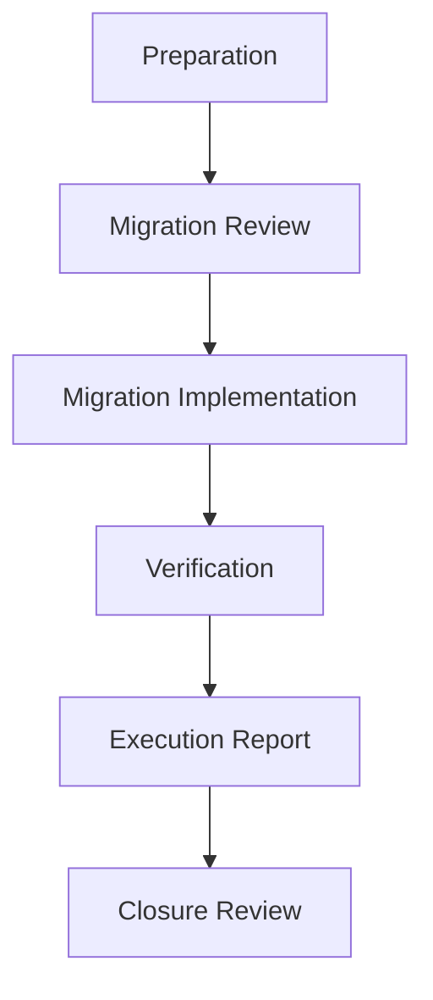

# Phase 2 Slice 1A SQL Migration Design

## Status

**Status:** Draft  
**Phase:** 2  
**Parent Slice:** 1 — Evidence Layer Foundation  
**Slice:** 1A  
**Artifact type:** SQL Migration Design  
**Depends on:**

- Phase 1 Governance Foundation (closed)
- `PHASE_2_IMPLEMENTATION_PLAN.md`
- `PHASE_2_SLICE_1_EVIDENCE_LAYER_FOUNDATION_PLAN.md` (approved)
- `PHASE_2_SLICE_1_TECHNICAL_DESIGN.md` (approved)
- `PHASE_2_SLICE_1A_EVIDENCE_PERSISTENCE_BOUNDARY_PLAN.md` (approved)
- `PHASE_2_SLICE_1A_TECHNICAL_DESIGN.md` (approved)

---

## Purpose

This document prepares the migration strategy for the first implementation slice of the Evidence Persistence Boundary while intentionally avoiding all SQL detail. It defines migration responsibilities, sequencing, compatibility expectations, and migration safety — the frame within which the first SQL migration will later be written, reviewed, and executed.

The separation is deliberate. Migration strategy is an architectural decision; migration statements are an implementation detail. Deciding strategy here ensures that when SQL is eventually written, it implements a reviewed plan rather than making structural decisions at authoring time.

This document contains no SQL, no schema definitions, no table or column definitions, no constraints, no indexes, no RLS policies, and no migration statements, and it authorizes no implementation.

---

## Migration Objectives

Conceptual objectives only:

- **Preserve existing production behaviour.** The platform continues to operate identically throughout migration. No user-visible behaviour, existing read surface, or persisted analysis changes as a side effect of introducing evidence persistence.
- **Introduce Evidence Persistence incrementally.** The evidence persistence boundary enters the system in small, independently reviewable steps rather than as a single structural event. Each step is complete, verified, and closable on its own.
- **Preserve history compatibility.** Existing history views and the analyses they present remain fully functional and unchanged until a future slice explicitly plans, reviews, and approves their migration into the evidence boundary.
- **Preserve governance guarantees.** Every record introduced by migration participates in the Phase 1 lifecycle, invocation, read eligibility, deletion governance, and storage retention contracts from the moment it exists. Migration never creates a pre-governance state.
- **Avoid breaking existing persistence.** Nothing currently persisted is modified, moved, or reinterpreted by the first migration. New persistence responsibilities are additive; existing records and their consumers are untouched.

---

## Migration Principles

Binding on the migration implementation that follows:

- **Forward-only evolution.** The persistence surface evolves through additive, sequenced migrations. No migration rewrites history or depends on undoing a previously executed migration to be correct.
- **Backward compatibility.** Every migration leaves all existing consumers — application code, read surfaces, and persisted data — functioning without modification. Compatibility breaks are their own planned slices, never migration side effects.
- **No destructive migration.** The first migration deletes nothing, truncates nothing, and drops nothing. Destructive operations of any kind are outside this slice and would require their own governance sequence.
- **Governance before persistence.** No evidence-bearing structure is introduced before its governance participation — lifecycle, eligibility, deletion addressability — is designed into it. Structures that would exist outside governance, even temporarily, are not permissible.
- **Evidence before derived knowledge.** Migration introduces evidence persistence first. No knowledge-layer or intelligence-layer persistence enters the system through this slice, consistent with the layer sequencing fixed in the Phase 2 Implementation Plan.
- **Reversible deployment strategy where practical.** Each migration step is designed so that, where practical, it can be safely neutralized or rolled back without data loss if verification fails. Where full reversibility is impractical, that limitation is stated explicitly in the migration artifact before review, not discovered at rollback time.
- **Explicit review before execution.** No migration is executed — in any environment leading to production — before its concrete design has passed gate review. Approval of this document approves the strategy, not any specific migration.

---

## Migration Scope

High-level scope only; no implementation is described.

The first migration is responsible for the architectural foundations defined by the Slice 1A Technical Design:

- **The evidence anchor structure.** Establishing the persisted representation of the scan record anchor as the root governance context to which evidence is subordinate.
- **Evidence-bearing record foundations.** Establishing persistence for the evidence categories that the technical design placed inside the boundary, in whatever subset the migration review approves as the first increment.
- **Lifecycle participation.** Ensuring every structure introduced carries the Phase 1 lifecycle status model and its mandatory transition metadata from inception.
- **Provenance retention.** Ensuring every structure introduced can retain the capture context and origin that the boundary requires as a condition of admission.
- **Storage reference capability.** Ensuring evidence structures can reference stored binaries without owning them, per the Phase 1 storage retention boundary.
- **Coexistence with existing persistence.** Ensuring everything introduced coexists additively with current persisted analyses, which remain authoritative for existing behaviour until explicitly migrated.

Which of these responsibilities land in the first migration versus subsequent increments is a sequencing decision for the migration artifact itself, made within this scope and confirmed at its review.

---

## Migration Non-Scope

This document and the slice it governs explicitly exclude:

- **No SQL**
- **No schema definitions**
- **No table definitions**
- **No constraints**
- **No indexes**
- **No triggers**
- **No RLS policies**
- **No API changes**
- **No UI changes**
- **No application logic changes**
- **No deployment**

Any of the above appearing in migration work under this slice without its own approved artifact constitutes scope breach and stops the slice.

---

## Migration Safety Requirements

Conceptual safety requirements binding on migration implementation:

- **Production continuity.** The platform remains fully operational before, during, and after every migration step. No step requires downtime, data unavailability, or degraded behaviour on existing surfaces.
- **Existing analysis preservation.** Currently persisted analyses are bit-for-bit untouched. Their content, availability, and consuming behaviour are identical before and after migration.
- **Auditability.** Every migration is traceable: what was executed, when, by what authority, against which environment, and under which approved artifact. A migration whose execution cannot be reconstructed after the fact fails this requirement.
- **Rollback planning.** Every migration step ships with an explicit rollback position — either a safe reversal path or an explicit, reviewed statement that reversal is impractical and what the mitigation is. Absence of a rollback position blocks review.
- **Explicit verification.** Every migration step defines, before execution, how success will be verified — including verification that existing behaviour is unchanged. Verification results are recorded in the execution report.
- **No hidden behavioural changes.** A migration changes exactly what its approved artifact says it changes. Any observed behavioural difference outside the approved scope is treated as an incident, not tolerated as a side effect.

---

## Migration Sequencing

Conceptual sequencing only. The slice proceeds through the following gate sequence, consistent with the Phase 2 gate model:

- **Preparation.** The concrete migration artifact is authored within the scope, principles, and safety requirements of this design.
- **Migration Review.** The migration artifact passes explicit gate review. Nothing executes before approval.
- **Migration Implementation.** The approved migration is implemented exactly as reviewed, within approved scope only.
- **Verification.** The predefined verification steps are executed, including confirmation that existing behaviour is unchanged.
- **Execution Report.** What was done, what was verified, and any deviations are documented.
- **Closure Review.** The slice is confirmed complete, residuals are made explicit, and only then may subsequent migration increments begin.

A step that discovers scope beyond its approval stops and returns to preparation. No step is skipped, merged, or performed out of order.

---

## Exit Criteria

This migration design is complete when:

1. **Migration objectives are accepted** at gate review as the binding intent of the first migration.
2. **Migration principles are accepted as binding** on all migration work under this slice.
3. **Scope and non-scope are accepted** — what the first migration is responsible for, and what it must not contain, are explicit and approved.
4. **Safety requirements are accepted as blocking** — a migration artifact that does not satisfy them cannot pass review.
5. **Sequencing is accepted** — the gate sequence is acknowledged as mandatory and unskippable.
6. **No implementation is authorized** — no SQL, migration statement, or runtime change results from this document.

---

## Current Decision

The next approved artifact after this migration design is the **first SQL migration itself**, derived from and constrained by this design. That migration is authored during Preparation, passes Migration Review before anything executes, and proceeds through the full gate sequence above. No SQL is written under this slice except in service of that reviewed artifact, and no migration executes before its explicit approval.

---

*End of Phase 2 Slice 1A SQL Migration Design.*
