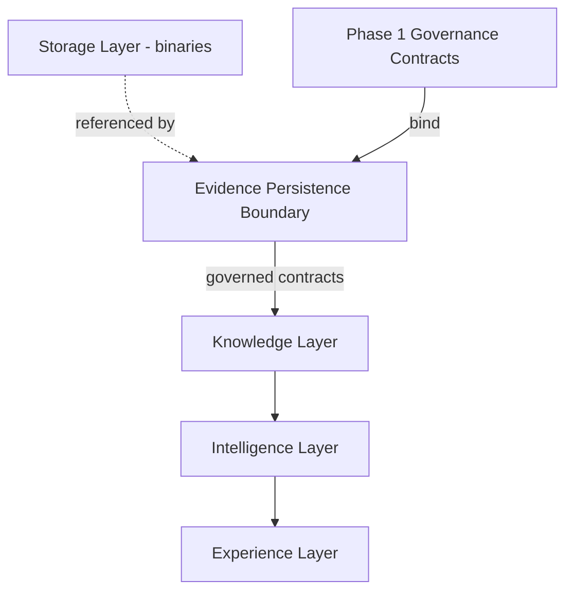

# Phase 2 Slice 1A Technical Design — Evidence Persistence Boundary

## Status

**Status:** Draft  
**Phase:** 2  
**Parent Slice:** 1 — Evidence Layer Foundation  
**Slice:** 1A  
**Artifact type:** Technical Design  
**Depends on:**

- Phase 1 Governance Foundation (closed)
- `PHASE_2_IMPLEMENTATION_PLAN.md`
- `PHASE_2_SLICE_1_EVIDENCE_LAYER_FOUNDATION_PLAN.md` (approved)
- `PHASE_2_SLICE_1_TECHNICAL_DESIGN.md` (approved)
- `PHASE_2_SLICE_1A_EVIDENCE_PERSISTENCE_BOUNDARY_PLAN.md` (approved)

---

## Design Goal

This document defines the architectural boundary of evidence persistence: which persistence responsibilities belong inside the Evidence Layer, which are referenced from it, and which are structurally excluded from it. It is the final design artifact before implementation planning begins.

The boundary exists to protect the layer separation established by the Slice 1 design. Evidence, Knowledge, Intelligence, and Storage are distinct architectural concerns; the persistence boundary is where that separation either survives or collapses. A persistence surface that mixes captured evidence with derived knowledge, inferred intelligence, or binary storage would make governance enforcement structurally impossible at the data layer — no eligibility rule, deletion scope, or retention boundary can be enforced against records whose layer identity is ambiguous.

This design therefore fixes the boundary before any migration or code exists, so that no structural decision about what evidence persistence is allowed to contain is made at implementation time.

This document contains no SQL, no schemas, no table or column definitions, no migrations, and no API contracts, and it authorizes no implementation.

---

## Architectural Responsibilities

Conceptual responsibilities only; nothing in this section defines implementation.

### What Evidence Persistence Owns

- **Evidence-bearing records.** The authoritative persisted representation of captured evidence: the scan record anchor and its subordinate evidence categories (user description, image evidence references, product mentions, AI analysis evidence) as defined in the Slice 1 design.
- **The anchor-and-subordinate structure.** The scan record is the root governance context; every persisted evidence record is subordinate to exactly one anchor and inherits its governance context from it.
- **Capture context.** The circumstances under which evidence entered the layer — session binding, consent state effective at capture time, and origin — persisted as part of the evidence itself.

### What Evidence Persistence References

- **Stored binaries.** Evidence persistence holds references to binary objects and their capture context. The binaries themselves remain governed by the Phase 1 storage and binary retention boundary.
- **Consent state.** Evidence records are bound to the consent state effective at capture time. Persistence references that state; it does not own or redefine the consent model.
- **Lifecycle governance primitives.** Evidence records carry lifecycle state and transition metadata, but the transition rules themselves belong to the Phase 1 lifecycle and invocation contracts, which persistence references and obeys.

### What Evidence Persistence Explicitly Does Not Own

- **Derived knowledge.** Interpretations, classifications, or enrichments of evidence belong to the Knowledge Layer. Persisted evidence must remain distinguishable from anything derived from it.
- **Intelligence outputs as conclusions.** Recommendations, scores, and insights built on evidence belong to the Intelligence Layer. An AI output is persisted as evidence only when its provenance is retained; without traceable inputs and session context it is not evidence and is outside this boundary.
- **Binary objects.** Evidence persistence never owns image or file binaries; ownership remains with the storage layer under the Phase 1 retention boundary.
- **Presentation state.** How evidence is displayed, filtered, or summarized is an Experience Layer concern and has no representation inside the evidence persistence boundary.

### Provenance Responsibility

Evidence persistence is responsible for retaining, with every evidence-bearing record, enough origin context that the record remains defensible as evidence: which session it belongs to, when and under what consent state it was captured, and — for analysis outputs — from which inputs it was produced. Provenance is a condition of admission into the boundary, not optional metadata.

### Lifecycle Participation

Every evidence-bearing record participates in the Phase 1 lifecycle status model (`active`/`excluded` with mandatory transition metadata). A record that carries evidence but cannot participate in the lifecycle model is a boundary violation, not a design option. Lifecycle transitions occur only through the governed primitives under the Phase 1 invocation contract, never through direct state manipulation.

### Consent Compatibility

Persistence remains bound to the consent state effective at capture time. A later change in consent does not retroactively alter what was captured; it is handled through the lifecycle and deletion governance models, not by rewriting persisted evidence.

### Backward Compatibility

Currently persisted analyses and existing history behavior continue to function unchanged until explicitly migrated. Migration of existing records into the evidence persistence boundary is its own planned, reviewed decision in a future slice; this design imposes no implicit migration obligation and permits no silent behavioral change to existing read surfaces.

---

## Persistence Boundary Rules

Every future implementation under this slice must satisfy all of the following conceptual rules:

1. **Layer identity is unambiguous.** Every persisted record is identifiable as evidence, and never simultaneously as knowledge, intelligence, or storage. No persistence surface mixes layer concerns.
2. **No evidence without an anchor.** Every evidence record is subordinate to exactly one scan record anchor and inherits its governance context from it. Anchorless evidence is not persistable.
3. **No evidence without provenance.** A record admitted as evidence retains its origin context. Outputs without traceable inputs and session context are refused admission to the boundary.
4. **No evidence outside the lifecycle model.** Every evidence-bearing record carries lifecycle state and transition metadata per the Phase 1 lifecycle contract, from the moment of persistence. There is no pre-governance holding state.
5. **Eligibility is enforceable at the boundary.** Read eligibility must be expressible and enforceable at the persistence boundary itself; it is never delegated solely to presentation layers.
6. **Deletion governance reaches every record.** Every evidence-bearing record is addressable by the scope models of the Phase 1 deletion request governance, with residuals explicit.
7. **References, never binary ownership.** Evidence persistence stores references and capture context for binaries; binary retention and cleanup remain separately governed under the Phase 1 storage retention boundary. Excluding or delete-requesting evidence never implies binary deletion.
8. **Evidence is immutable as captured.** Consumption never mutates evidence, and governance actions change eligibility state, not captured content.
9. **Existing behavior is preserved until migrated.** No implementation may alter existing persisted analyses or history behavior except through an explicitly planned and approved migration slice.
10. **Contract insufficiency escalates.** An implementation that finds a Phase 1 contract insufficient stops and escalates to governance work; it does not reinterpret the contract at the persistence layer.

---

## Layer Relationships

Conceptual interactions only:

- **Phase 1 contracts bind the boundary.** Lifecycle, invocation, read eligibility, deletion governance, and storage retention contracts apply to every record inside the boundary, unchanged and in full.
- **Storage is referenced, never absorbed.** The evidence boundary points at binaries; it never contains them. The retention relationship between evidence references and binary cleanup remains a separately governed concern.
- **Knowledge consumes evidence through governed contracts only.** The Knowledge Layer reads eligible evidence; it never writes into the evidence boundary and never stores interpretations inside it.
- **Intelligence never reaches past Knowledge into raw persistence.** Derived insight is built on governed consumption paths; there is no contract-free access route from higher layers to evidence persistence.
- **AI providers sit outside every layer.** Analysis outputs cross into the boundary only as provenance-bearing evidence; no provider, model, or prompt is a structural dependency of persistence.

---

## Deferred Decisions

Intentionally deferred to future implementation slices, each with its own planning, design, and review sequence:

- Physical schema design (tables, columns, types, constraints)
- SQL migration content and sequencing
- Identifier and keying strategy
- Row-level security policy design
- Indexing and query performance strategy
- Mapping and migration of existing analysis records into the boundary
- Data backfill strategy
- API and service contracts over evidence persistence
- Storage/binary implementation and cleanup mechanics
- Caching, background jobs, and operational tooling
- Deployment and rollout sequencing

Binding any of these now would couple the boundary definition to implementation detail it does not need and would pre-empt decisions that belong to reviewed implementation slices.

---

## Design Exit Criteria

This design is complete when:

1. **Ownership is unambiguous** — what evidence persistence owns, references, and excludes is explicitly stated and accepted at gate review.
2. **Boundary rules are binding** — the persistence boundary rules are accepted as mandatory constraints on every future implementation slice under Slice 1.
3. **Governance contracts are preserved** — all five Phase 1 contracts are acknowledged as binding and unmodified by this design.
4. **Deferred decisions are explicit** — every implementation decision left open is listed and assigned to future slices, with none silently resolved here.
5. **No implementation is authorized** — no code, SQL, migration, or runtime change results from this design.

---

## Current Decision

The next artifact after approval of this design is the **first SQL Migration Design** for the Evidence Persistence Boundary — not another planning document. That migration design remains subject to the full Phase 2 gate sequence: it must be reviewed and approved before any migration is written, and no code, SQL, or runtime change occurs before that approval.

---

*End of Phase 2 Slice 1A Technical Design.*
