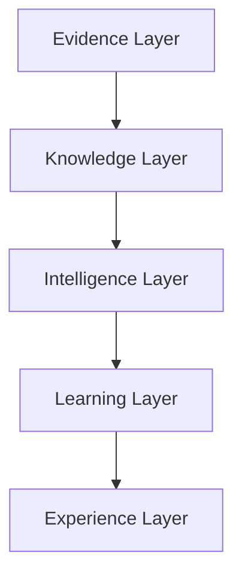

# Phase 2 Slice 1 Technical Design — Evidence Layer Foundation

## Status

**Status:** Draft  
**Phase:** 2  
**Slice:** 1  
**Artifact type:** Technical Design  
**Depends on:**

- Phase 1 Governance Foundation (closed)
- `PHASE_2_IMPLEMENTATION_PLAN.md`
- `PHASE_2_SLICE_1_EVIDENCE_LAYER_FOUNDATION_PLAN.md` (approved)

---

## Design Goal

This document translates the approved planning scope for the Evidence Layer Foundation into an implementation-ready architectural design while preserving every governance contract established in Phase 1.

It defines architectural responsibilities and boundaries only. It contains no SQL, no schemas, no API contracts, and no implementation code, and it authorizes no implementation. Its purpose is to give future implementation slices a fixed architectural frame so that no structural decision is made at coding time.

---

## Architectural Position

The Evidence Layer is:

- **The lowest governed implementation layer.** Nothing implemented in Phase 2 sits below it; it rests directly on the Phase 1 governance contracts.
- **The system of record for evidence.** Captured user descriptions, images, product mentions, and analysis outputs are authoritative here and nowhere else.
- **The foundation consumed by all higher layers.** Knowledge, Intelligence, Learning, and Experience work builds on evidence; none of them owns or duplicates it.
- **Incapable of bypassing governance.** Lifecycle status, eligibility, deletion governance, and retention boundaries are enforced within the layer, not delegated to callers' good behavior.
- **Independent from AI providers.** Evidence semantics do not depend on any provider, model, or prompt; AI outputs enter the layer as governed evidence, never as a structural dependency.

Every higher layer consumes evidence through governed contracts only. There is no direct, contract-free access path to evidence from any layer above.

---

## Evidence Categories

Conceptual responsibilities only; no fields or tables are defined here.

- **Scan Record.** The session anchor. It establishes the governance context — ownership, consent linkage, and lifecycle state — under which all evidence in a session exists. It is the root to which every other evidence category is subordinate.
- **User Description Evidence.** Holds what the user stated in their own words. Its responsibility is faithful, unmodified capture of user input as evidence, distinct from any interpretation derived from it.
- **Image Evidence.** Holds the evidentiary link between a session and captured imagery. It owns the reference to stored binaries and the capture context; it does not own the binaries themselves, which remain governed by the Phase 1 storage retention boundary.
- **Product Mention Evidence.** Holds product references associated with a session — whether user-declared or extraction-derived — as evidence of what was mentioned, distinct from any knowledge-layer interpretation of what the product is.
- **AI Analysis Evidence.** Holds analysis outputs as governed evidence rather than transient results. Its responsibility is provenance: what was produced, from which inputs, under which session — so that derived intelligence remains traceable to governed evidence.

---

## Evidence Lifecycle

Conceptual lifecycle, without implementation:

1. **Capture.** Evidence enters the layer bound to a session anchor and the consent state effective at capture time. Evidence without governance context is not capturable.
2. **Governed persistence.** Persisted evidence immediately participates in the lifecycle status model; there is no pre-governance holding state.
3. **Governed eligibility.** Lifecycle state determines eligibility. Active evidence is eligible for consumption; excluded evidence is not eligible as normal active evidence, per the Phase 1 read eligibility contract.
4. **Governed consumption.** Higher layers consume evidence only through contracts that respect eligibility. Consumption never mutates evidence.
5. **Exclusion.** Evidence transitions `active` → `excluded` only through the governed primitives under the Phase 1 invocation contract — never through direct state manipulation by any layer.
6. **Deletion governance.** Deletion requests address evidence through the Phase 1 deletion request governance model: exclusion of eligibility, not physical removal, with residuals explicit.
7. **Storage retention compatibility.** Evidence referencing stored binaries remains within the Phase 1 retention boundary: excluding or delete-requesting evidence never implies binary deletion, which remains a separately governed future concern.

---

## Design Constraints

The design preserves, unchanged and in full:

- **Lifecycle contract** — the `active`/`excluded` state model with mandatory transition metadata.
- **Invocation contract** — the authorized consumer boundary and closed reason taxonomy.
- **Read eligibility** — excluded evidence is never presented as normal active evidence.
- **Deletion governance** — intake, authority, scope, and residual handling rules.
- **Storage retention boundary** — lifecycle state and binary retention are separate governed concerns.

No Evidence Layer component may redefine these contracts. A future implementation slice that finds a contract insufficient must escalate to governance work; it must not reinterpret the contract within the layer.

---

## Layer Interaction

Conceptual interaction only:

- **Upward dependency is allowed.** Each layer may depend on the layers beneath it, consumed through their governed contracts.
- **Downward bypass is forbidden.** No layer may reach past an intermediate layer to access evidence directly, and no layer may access evidence outside its governed contract. The Experience Layer, for example, never reads evidence directly; it consumes what the layers beneath it expose.

---

## Deferred Decisions

Intentionally deferred to future implementation slices:

- Physical persistence
- Migration sequencing
- APIs
- Storage implementation
- Performance optimisation
- Indexing
- Caching
- Background jobs

Each deferred decision belongs to a future slice with its own planning, design, and review sequence. Deferral is deliberate: binding these choices now would couple the architectural frame to implementation detail it does not need.

---

## Design Exit Criteria

This design is complete when:

1. **Architectural responsibilities are defined** for the Evidence Layer and each evidence category.
2. **Governance boundaries are preserved** — all five Phase 1 contracts acknowledged as binding and unmodified.
3. **Implementation decisions remain deferred** — no persistence, API, or operational choice is bound by this document.
4. **No implementation is authorized** — no code, SQL, migration, or runtime change results from this design.

---

## Current Decision

Implementation planning may continue only through future reviewed implementation slices derived from this design. Each such slice must pass the full Phase 2 gate sequence — plan, technical design, review, implementation, execution report, closure review — before any code or database change occurs.

---

*End of Phase 2 Slice 1 Technical Design.*
